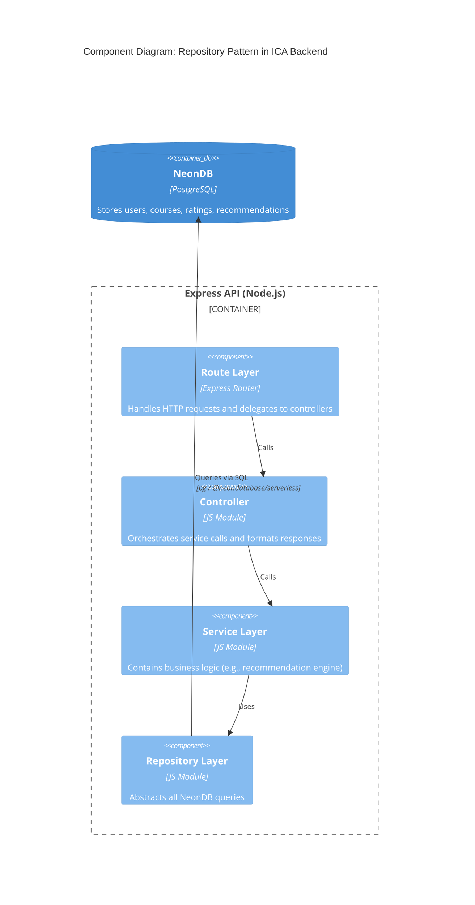
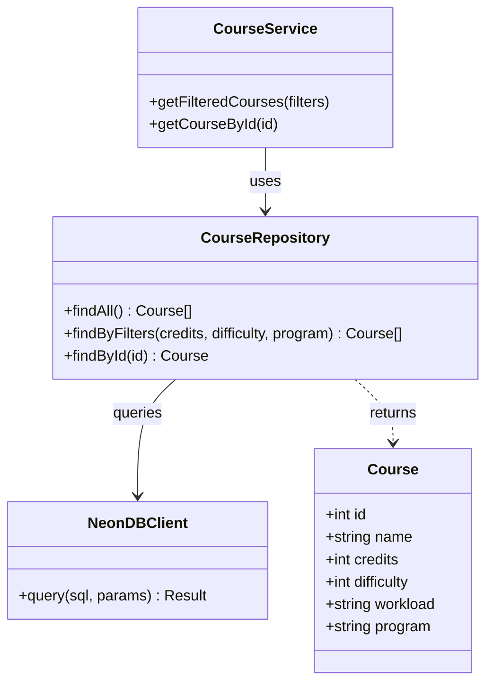
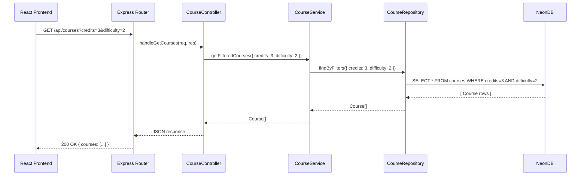
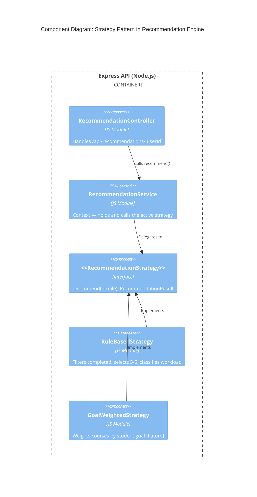
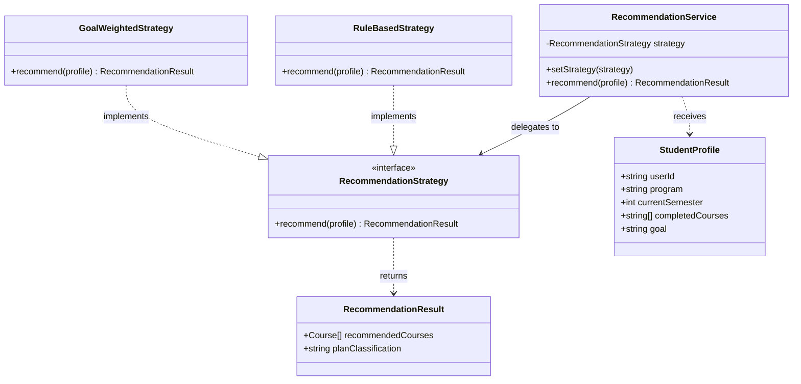
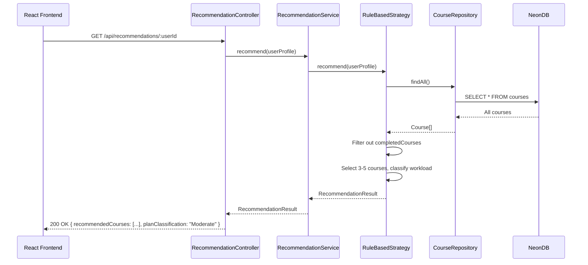

# Intelligent Course Advisor (ICA) — Task 3: Architectural Tactics and Patterns

---

## Part 1: Architectural Tactics

Architectural tactics are design decisions that directly influence the achievement of a specific non-functional requirement (NFR). Unlike patterns (which solve structural problems), tactics are targeted responses to quality concerns.

The five tactics below are selected to address all NFRs identified in Task 1.

---

### Tactic 1: Caching API Responses (Addresses NFR-01 — Performance)

**NFR Addressed:** Dashboard and recommendations should load within 2 seconds; course search should respond in under 1 second.

**Explanation:**

Caching means storing the result of an expensive operation so that repeated requests return the saved result instead of recomputing or re-querying.

In ICA, the course catalogue and the dashboard aggregation both require database queries. If 50 students load the course catalogue simultaneously, running 50 identical SQL queries is wasteful. With caching, the result of `GET /api/courses` is stored in memory (e.g., using `node-cache` or an in-memory object in Express) for a short duration (e.g., 60 seconds). Subsequent requests within that window are served instantly.

**How it is applied in ICA:**
- Cache the course catalogue response at the Express API layer (data changes infrequently)
- Cache per-user dashboard aggregation for a short TTL (time-to-live) to avoid redundant DB joins
- Invalidate cache when a user updates their profile or completed courses

**Real-life analogy:** A restaurant menu board — the kitchen doesn't re-cook a sample dish every time a customer looks at the menu. The menu is prepared once and displayed until it changes.

---

### Tactic 2: Database Indexing (Addresses NFR-01 — Performance & NFR-03 — Scalability)

**NFR Addressed:** Course search and filtering should respond in under 1 second; system should scale with increasing course data.

**Explanation:**

An index in a database is like the index at the back of a textbook. Without it, the database scans every row to find matching records (full table scan). With an index on a column, the database jumps directly to the relevant rows.

In ICA, filtering courses by `credits`, `difficulty`, or `program` without indexes means every filter request reads the entire `courses` table. As the catalogue grows, this becomes progressively slower.

**How it is applied in ICA:**

Indexes will be created on the NeonDB `courses` table for the most frequently filtered columns:

```sql
CREATE INDEX idx_courses_credits    ON courses(credits);
CREATE INDEX idx_courses_difficulty ON courses(difficulty);
CREATE INDEX idx_courses_program    ON courses(program);
```

A `GIN` or `ILIKE`-compatible index will also be applied for name search to support fast text matching.

**Real-life analogy:** Searching for a word in a dictionary — you don't read every page. You jump to the right letter section because the dictionary is already indexed alphabetically.

---

### Tactic 3: Separation of Concerns via Layered Architecture (Addresses NFR-05 — Maintainability)

**NFR Addressed:** Codebase should be modular and easy to extend.

**Explanation:**

Separation of concerns means each part of the system is responsible for exactly one thing. No layer reaches into another layer's territory. This makes each component independently testable, replaceable, and understandable.

In ICA, the backend is structured into clear layers:

| Layer | Responsibility | Example |
|---|---|---|
| Route Layer | Parse HTTP requests, call controllers | `courses.routes.js` |
| Controller Layer | Orchestrate logic, call services | `courses.controller.js` |
| Service Layer | Business logic | `recommendation.service.js` |
| Repository Layer | Database access only | `courses.repository.js` |

A route never touches the database directly. A repository never contains business logic. Each layer communicates only with the layer directly below it.

**How it is applied in ICA:**
- Recommendation logic lives in `recommendation.service.js` — not in routes
- All NeonDB queries are isolated in repository files
- React components call API endpoints only — no direct DB access from the frontend

**Real-life analogy:** A restaurant — the waiter (route) takes your order and passes it to the chef (service), who uses the kitchen equipment (repository/database). The waiter never cooks; the chef never serves tables.

---

### Tactic 4: Input Validation and Consistent Error Handling (Addresses NFR-04 — Data Consistency)

**NFR Addressed:** User profile and course data must remain accurate across sessions.

**Explanation:**

Data consistency is threatened when invalid or malformed data enters the system. If a user submits a profile with a negative semester number, or a course with a difficulty rating of 9, the database may store incorrect data that corrupts recommendations.

Input validation ensures all incoming data is checked before it reaches the service or database layer. Consistent error handling ensures that when something goes wrong, the system returns a predictable, informative response instead of crashing or silently failing.

**How it is applied in ICA:**
- Use `express-validator` or `Joi` middleware in the Express API to validate all `POST`/`PUT` request bodies before they reach the controller
- Validate: semester is between 1–8, credits are positive integers, difficulty/workload are within allowed enum values
- All API errors return a standard JSON structure:
```json
{
  "status": "error",
  "code": 400,
  "message": "Semester must be between 1 and 8"
}
```
- Database constraints (e.g., `CHECK (difficulty BETWEEN 1 AND 5)`) act as a second line of defense

**Real-life analogy:** A bank's ATM — it validates your PIN before allowing any transaction. Even if someone bypasses the screen, the bank's server re-validates the request independently.

---

### Tactic 5: Component-Based UI Architecture (Addresses NFR-02 — Usability & NFR-05 — Maintainability)

**NFR Addressed:** Onboarding should be completable within 2 minutes; core actions achievable in 3 clicks.

**Explanation:**

React's component model allows the UI to be broken into small, reusable, independently renderable pieces. Each component manages its own state and renders predictably. This directly supports usability because:
- Navigation between views (onboarding → dashboard → catalogue) is instant (client-side routing, no full page reload)
- Components like `<CourseCard />`, `<FilterBar />`, and `<RecommendationList />` are reusable, reducing inconsistency
- State changes (e.g., applying a filter) re-render only the affected component, not the whole page

**How it is applied in ICA:**

Key UI components:
- `<OnboardingForm />` — multi-step form guiding the user through profile setup
- `<Dashboard />` — aggregates progress data from the API and renders credit summary + recommendations
- `<CourseCatalogue />` — contains `<FilterBar />` and a list of `<CourseCard />` components
- `<RecommendationPanel />` — displays the generated semester plan with workload classification

React Router handles navigation so transitions between these views require zero server round-trips.

**Real-life analogy:** LEGO — each brick (component) is self-contained and can be assembled in any combination. Changing one brick doesn't require rebuilding the entire structure.

---

## Part 2: Implementation Patterns

Two design patterns are described below with full diagrams. A third supporting pattern (Layered/MVC) is referenced where relevant.

---

### Pattern 1: Repository Pattern

#### What is it?

The Repository Pattern creates an abstraction layer between the business logic (services) and the data access layer (database queries). Instead of writing raw SQL inside service files, all database operations are encapsulated inside dedicated repository classes or modules.

**Real-life analogy:** Think of a repository as a library catalogue system. When you want a book, you ask the librarian (repository) — you don't go rummaging through the shelves yourself. The librarian knows where everything is stored and how to retrieve it. Your job (the service) is just to use the book, not to know how it's stored.

#### Why use it in ICA?

- The Express backend interacts with NeonDB for users, courses, and ratings
- Without this pattern, SQL queries are scattered across route handlers and service files — hard to test and maintain
- With this pattern, if the database changes (e.g., NeonDB → another PostgreSQL provider), only the repository files change — services are unaffected
- Directly supports **NFR-05 (Maintainability)** and **ADR-002 (NeonDB decision)**

#### How it works in ICA

Each major data entity has its own repository module:

| Repository | Responsibility |
|---|---|
| `UserRepository` | `findById`, `create`, `updateProfile` |
| `CourseRepository` | `findAll`, `findByFilters`, `findById` |
| `RecommendationRepository` | `saveRecommendation`, `getByUserId` |

A service calls the repository. The repository calls NeonDB. The service never writes SQL.

---

#### C4 Component Diagram — Repository Pattern



---

#### UML Class Diagram — Repository Pattern



---

#### UML Sequence Diagram — Fetch Filtered Courses



---

### Pattern 2: Strategy Pattern

#### What is it?

The Strategy Pattern defines a family of algorithms, encapsulates each one, and makes them interchangeable. The calling code (context) works with a common interface — it doesn't know or care which specific algorithm is running.

**Real-life analogy:** A GPS navigation app (Google Maps) offers multiple route strategies — fastest, shortest, avoid tolls, cycling route. The app's UI doesn't change based on which strategy you pick. You swap the strategy; the rest of the app stays the same.

#### Why use it in ICA?

- The Recommendation Engine (FR-04) currently uses rule-based logic (filter → select → classify)
- In Task 3+, a more intelligent algorithm may be introduced (weighted scoring, goal-based prioritization)
- Without this pattern, swapping the algorithm means rewriting the service file — risky and error-prone
- With this pattern, the `RecommendationService` calls a strategy interface. New algorithms are added as new strategy classes without modifying existing code
- Directly supports **ADR-004 (Recommendation Engine as Express module)** and **NFR-05 (Maintainability)**
- Also embodies the **Open/Closed Principle** — open for extension, closed for modification

#### How it works in ICA

A `RecommendationStrategy` interface defines one method: `recommend(profile)`. Two concrete strategies implement it:

| Strategy | Description |
|---|---|
| `RuleBasedStrategy` | Current logic — filter completed, select 3–5, classify workload |
| `GoalWeightedStrategy` | Future logic — weights courses by student goal (Placement / Research / Skills) |

The `RecommendationService` holds a reference to whichever strategy is active. Switching strategies requires one line of code.

---

#### C4 Component Diagram — Strategy Pattern



---

#### UML Class Diagram — Strategy Pattern



---

#### UML Sequence Diagram — Generate Recommendation



---

### Supporting Pattern: Layered (MVC-style) Architecture

While not the primary focus of the diagrams above, the ICA backend follows a **Layered Architecture** pattern throughout. This is the structural backbone that makes both the Repository and Strategy patterns possible.

The four layers are:

```
┌─────────────────────────────────┐
│         React Frontend          │  ← View Layer
├─────────────────────────────────┤
│     Express Route + Controller  │  ← Controller Layer
├─────────────────────────────────┤
│     Service + Strategy Engine   │  ← Business Logic Layer
├─────────────────────────────────┤
│  Repository + NeonDB            │  ← Data Access Layer
└─────────────────────────────────┘
```

Each layer communicates only with the layer directly below it. This enforces separation of concerns (Tactic 3) and makes each layer independently testable.

---

## Summary

### Tactics Overview

| Tactic | NFR Addressed | Where Applied |
|---|---|---|
| Caching API Responses | NFR-01 Performance | Express API layer |
| Database Indexing | NFR-01 Performance, NFR-03 Scalability | NeonDB schema |
| Separation of Concerns (Layered) | NFR-05 Maintainability | Entire backend structure |
| Input Validation & Error Handling | NFR-04 Data Consistency | Express middleware |
| Component-Based UI | NFR-02 Usability, NFR-05 Maintainability | React frontend |

### Patterns Overview

| Pattern | Role in ICA | NFR / ADR Linkage |
|---|---|---|
| Repository Pattern | Abstracts NeonDB access; isolates SQL from business logic | NFR-05, ADR-002 |
| Strategy Pattern | Makes recommendation algorithm swappable without code changes | NFR-05, ADR-004 |
| Layered Architecture | Structural backbone enforcing separation across all subsystems | NFR-05, ADR-003 |
